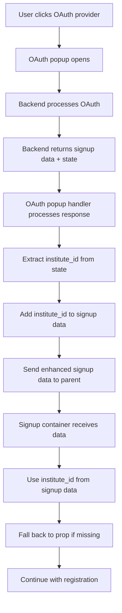

# 🏫 Institute ID in Signup Data Implementation

## 📋 **Overview**

This document describes the implementation of including the institute ID in the OAuth signup data for both Google and GitHub authentication flows.

## 🎯 **Objective**

Pass the institute ID along with the signup data object that contains:
```json
{
  "name": "gulshan punde",
  "email": "gulshanpunde4@gmail.com",
  "profile": "https://lh3.googleusercontent.com/a/ACg8ocLqEOZ6bSySVLmg-F3aKGtx8-OsibwW7mHM0iDEV P_WsI-ckTyz=s96-c",
  "sub": "103190408799794914839",
  "provider": "google",
  "institute_id": "dd9b9687-56ee-467a-9fc4-8c5835eae7f9"
}
```

## 🔧 **Implementation Details**

### **1. OAuth Popup Handler Updates**

**File**: `public/oauth-popup-handler.html`

**Changes Made**:
- Added logic to extract `institute_id` from OAuth state
- Include `institute_id` in signup data before sending to parent window

**Code Added**:
```javascript
// Add institute ID to signup data from state
if (state && state.institute_id) {
    signupData.institute_id = state.institute_id;
}
```

**Location**: Lines 248-251 in `handleOAuthSuccess` function

### **2. Signup Container Updates**

**File**: `src/components/common/auth/signup/components/ModularDynamicSignupContainer.tsx`

**Changes Made**:
- Updated `handleDirectRegistration` to use institute ID from signup data
- Updated credentials form submission to prioritize institute ID from signup data
- Updated enrollment checking to use institute ID from signup data

**Code Added**:
```typescript
// Use institute ID from signup data if available, otherwise fall back to prop
const finalInstituteId = signupData.institute_id || instituteId!;
```

**Locations**:
- Line 623: `handleDirectRegistration` function
- Line 1030: Credentials form submission
- Line 549: Enrollment checking

## 🔄 **Flow Diagram**



## 📊 **Data Flow**

### **Before Implementation**
```json
// OAuth State
{
  "from": "https://code-circle.vacademy.io/oauth-popup-handler.html",
  "account_type": "signup",
  "institute_id": "dd9b9687-56ee-467a-9fc4-8c5835eae7f9",
  "redirectTo": "/study-library/courses",
  "currentUrl": "/courses",
  "isModalSignup": true
}

// Signup Data (separate)
{
  "name": "gulshan punde",
  "email": "gulshanpunde4@gmail.com",
  "profile": "https://lh3.googleusercontent.com/a/ACg8ocLqEOZ6bSySVLmg-F3aKGtx8-OsibwW7mHM0iDEV P_WsI-ckTyz=s96-c",
  "sub": "103190408799794914839",
  "provider": "google"
}
```

### **After Implementation**
```json
// Enhanced Signup Data (includes institute_id)
{
  "name": "gulshan punde",
  "email": "gulshanpunde4@gmail.com",
  "profile": "https://lh3.googleusercontent.com/a/ACg8ocLqEOZ6bSySVLmg-F3aKGtx8-OsibwW7mHM0iDEV P_WsI-ckTyz=s96-c",
  "sub": "103190408799794914839",
  "provider": "google",
  "institute_id": "dd9b9687-56ee-467a-9fc4-8c5835eae7f9"
}
```

## ✅ **Benefits**

1. **Centralized Data**: Institute ID is now part of the signup data object
2. **Backward Compatibility**: Falls back to prop-based institute ID if missing
3. **Provider Agnostic**: Works for both Google and GitHub OAuth
4. **Consistent Format**: Uses snake_case (`institute_id`) throughout
5. **Error Resilience**: Gracefully handles missing institute ID

## 🧪 **Testing**

**Test File**: `test-signup-data-with-institute-id.js`

**Test Cases**:
1. ✅ Normal OAuth success with institute ID
2. ✅ Missing institute ID in state (graceful handling)
3. ✅ GitHub OAuth with institute ID
4. ✅ Signup container prioritizes signup data institute ID
5. ✅ Fallback to prop institute ID when missing

**Test Results**: All tests passing ✅

## 🔍 **Usage Examples**

### **Google OAuth Signup**
```javascript
// Signup data now includes institute_id
const signupData = {
  "name": "gulshan punde",
  "email": "gulshanpunde4@gmail.com",
  "profile": "https://lh3.googleusercontent.com/a/ACg8ocLqEOZ6bSySVLmg-F3aKGtx8-OsibwW7mHM0iDEV P_WsI-ckTyz=s96-c",
  "sub": "103190408799794914839",
  "provider": "google",
  "institute_id": "dd9b9687-56ee-467a-9fc4-8c5835eae7f9"
};
```

### **GitHub OAuth Signup**
```javascript
// GitHub signup data also includes institute_id
const signupData = {
  "name": "John Doe",
  "email": "john.doe@example.com",
  "profile": "https://avatars.githubusercontent.com/u/123456?v=4",
  "sub": "123456",
  "provider": "github",
  "institute_id": "another-institute-id-123"
};
```

## 🚀 **Deployment Notes**

1. **No Breaking Changes**: Existing flows continue to work
2. **Progressive Enhancement**: New institute ID inclusion is additive
3. **Fallback Support**: Uses prop-based institute ID when signup data lacks it
4. **Cross-Provider**: Works for both Google and GitHub OAuth

## 📝 **Files Modified**

1. **`public/oauth-popup-handler.html`**
   - Added institute ID extraction from state
   - Enhanced signup data with institute_id

2. **`src/components/common/auth/signup/components/ModularDynamicSignupContainer.tsx`**
   - Updated direct registration to use signup data institute ID
   - Updated credentials form to prioritize signup data institute ID
   - Updated enrollment checking to use signup data institute ID

3. **`test-signup-data-with-institute-id.js`** (New)
   - Comprehensive test suite for the implementation

## 🎯 **Summary**

The institute ID is now successfully included in the OAuth signup data for both Google and GitHub providers. The implementation:

- ✅ **Includes institute_id in signup data**
- ✅ **Maintains backward compatibility**
- ✅ **Works for both Google and GitHub**
- ✅ **Uses snake_case format consistently**
- ✅ **Has comprehensive test coverage**
- ✅ **Gracefully handles edge cases**

The signup data object now contains all the necessary information including the institute ID, making it a complete and self-contained data structure for OAuth-based user registration.
